## Sommaire

1. [Manuel de l'utilisateur](#utilisateur)
	1. [Installation](#installation)
	2. [Compilation et première exécution](#compilation)
	3. [Tests unitaires](#tests)
	4. [Documentation](#doc)
	5. [Exécution](#execution)
2. [Manuel technique](#technique)
	1. [Définitions](#definitions)
		1. [Algorithme de chiffrement](#algo_chiffrement)
		2.  [Mode opératoire](#mode_operatoire)
	2. [Fonctionnement du chiffrement de GoShield](#fonction_chiffr)
	3. [Fonctionnement du déchiffrement de GoShield](#fonction_dechiff)
3. [Solution explicative](#solution)
	1. [Gestion des commandes de l'utilisateur](#commandes)
		1. [Récupération des commandes de l'utilisateur](#parse)
		2. [Interprétation des commandes de l'utilisateur](#interpret)
	2. [Chiffrement/Déchiffrement des données de l'utilisateur](#crypto)
		1. [Préliminaires des calculs cryptographiques](#hash)
		2. [Chiffrement des données de l'utilisateur](#encrypt)
			1. [Chiffrement d'un bloc](#encrypt_bloc)
			2. [Chiffrement de fichiers/dossiers](#encrypt_file_folder)
				1. [Chiffrement sans goroutine](#encrypt_sans_goroutine)
				2. [Chiffrement avec goroutines](#encrypt_avec_goroutine)
		3. [Déchiffrement des données de l'utilisateur](#decrypt)
			1. [Déchiffrement d'un bloc](#decrypt_bloc)
			2. [Déchiffrement de fichiers/dossiers](#decrypt_file_folder)
				1. [Déchiffrement sans goroutine](#decrypt_sans_goroutine)
				2. [déchiffrement avec goroutines](#decrypt_avec_goroutine)
	2. [Comparaison de l'application avec et sans l'utilisation de goroutines](#comparaison)


## Manuel de l'utilisateur <a id="utilisateur"></a> 

### Installation <a id="installation"></a> 

Pour télécharger l'application, deux méthodes sont disponibles :

- Taper la commande `go get github.com/Heisenberk/goshield` 


- Taper la commande `git clone https://www.github.com/Heisenberk/goshield` ou télécharger le code source directement sur Github 

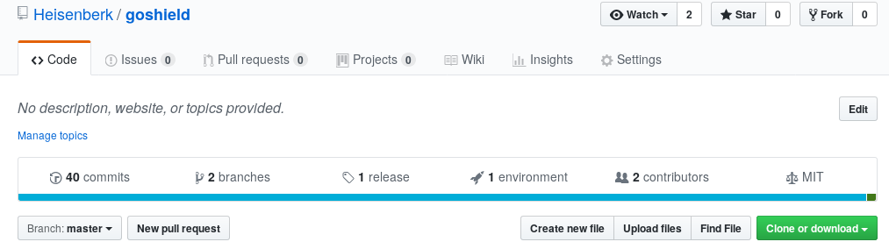

Dans le dossier `$(GOPATH)`, le package `github.com/Heisenberk/goshield` sera installé. 

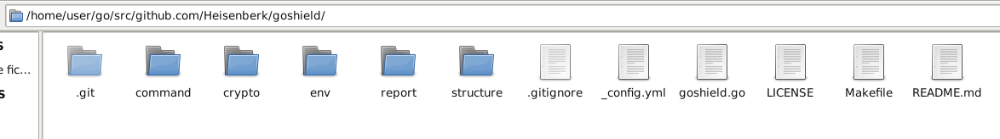

Un Makefile y est intégré pour faciliter les tâches pour le développeur/utilisateur. 

- Exécuter la commande `make install` pour compiler et exécuter le programme en ligne de commande avec le mot clé `goshield`. 

### Compilation et première exécution <a id="compilation"></a> 

Pour compiler et générer ainsi un exécutable manuellement, taper la commande `make compil && ./goshield` ou tout simplement `make all`. La liste des commandes seront affichées : 

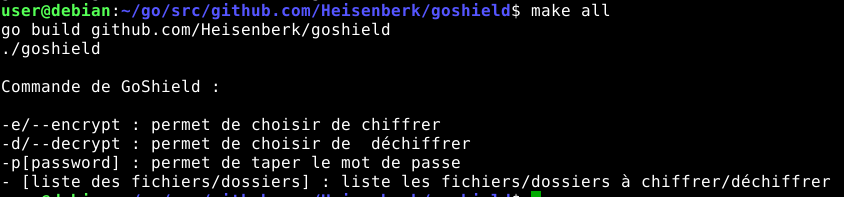

### Tests unitaires <a id="tests"></a> 

Pour exécuter les tests unitaires, écrire `make test`, qui testeront les sous-packages `goshield/crypto` et `goshield/command`. 

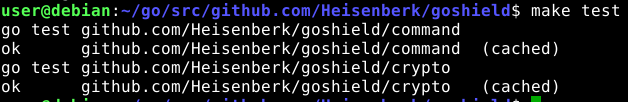

### Documentation <a id="doc"></a> 

Taper dans le terminal la commande `godoc -http=:8080`, puis, dans le même temps, visiter l'adresse sur un navigateur `http://localhost:8080/pkg/github.com/Heisenberk/goshield`. 

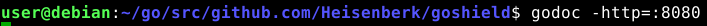

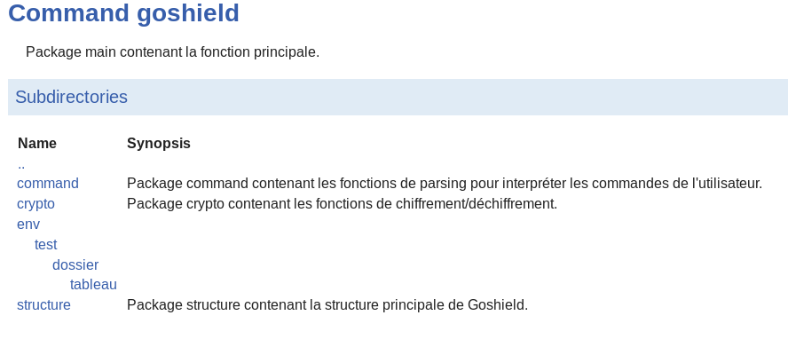

### Exécution <a id="execution"></a> 

- Pour afficher les commandes : 

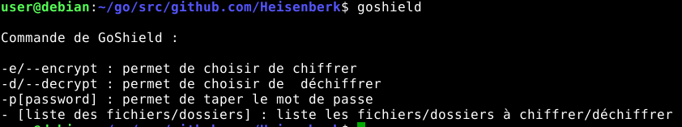

- Pour chiffrer avec le mot de passe "soutenance" la suite de fichiers/dossiers suivants : 

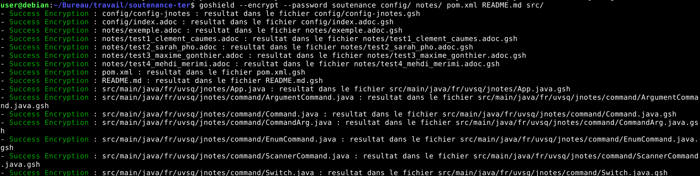

- Pour déchiffrer avec le mot de passe "soutenance" la suite de fichiers/dossiers suivants : 

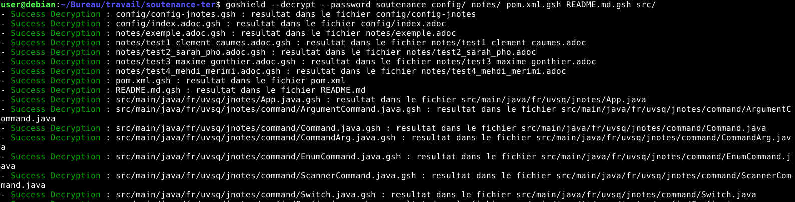

## Manuel technique <a id="technique"></a> 

### Définitions <a id="definitions"></a> 

#### Algorithme de chiffrement <a id="algo_chiffrement"></a> 

L'algorithme de chiffrement choisi pour ce logiciel est l'AES ([Advanced Encryption Standard](https://fr.m.wikipedia.org/wiki/Advanced_Encryption_Standard)). C'est l'un des algorithmes symétriques les plus sécurisés puisqu'aucune attaque n'a été démontrée (mise à part l'attaque par force brute qui n'est pas réalisable avec la puissance de calcul actuelle). 

AES propose 3 tailles de clés différentes : 128, 192 ou 256 bits. GoShield proposera donc AES-256 pour être le plus sécurisé possible. 
De plus, les données à chiffrer doivent être sur 128 bits. 

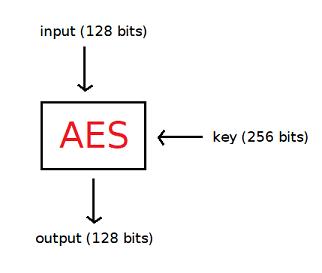

#### Mode opératoire <a id="mode_operatoire"></a> 

Sachant que l'utilisateur voudra chiffrer/déchiffrer des fichiers de taille variable, il faut utiliser un mode opératoire. Un mode opératoire permet de traiter plusieurs blocs de texte clairs/chiffrés. Le mode opératoire le plus efficace trouvé aujourd'hui est le mode CBC. Son seul désavantage est le fait qu'il soit séquentiel et non parallélisable. Son meilleur atout est le fait que 2 clairs chiffrés avec la même clé donneront 2 chiffrés différents car du pseudo-aléatoire est mis en jeu (avec la valeur initiale IV). 


### Fonctionnement du chiffrement <a id="fonction_chiffr"></a> 

Le chiffrement d'un fichier consiste en plusieurs étapes : 
- écriture de la signature `GOSHIELD` : cette signature permettra de vérifier lors du déchiffrement que l'on fait bien un déchiffrement sur le format `gsh`. 
- génération et écriture du [sel cryptographique](https://fr.wikipedia.org/wiki/Salage_(cryptographie) : ce sel cryptographique sera généré de façon pseudo-aléatoire et sera sur 15 bits. Il sera concaténé au mot de passe choisi par l'utilisateur. Enfin, cette concaténation sera hachée en utilisant la fonction de hachage [SHA-256](https://www.movable-type.co.uk/scripts/sha256.html) permettant de générer une clé AES sur 256 bits. 
- génération et écriture du [vecteur d'initialisation (IV)](https://fr.wikipedia.org/wiki/Vecteur_d%27initialisation) : ce vecteur sera utilisé dans le chiffrement du premier bloc dans l'algorithme AES. 
- écriture de la taille du dernier bloc en octets : en effet, le fichier ne sera pas forcément un multiple de 128 bits. Cela signifie qu'on utilisera du padding (avec des 0) pour compléter le dernier bloc. Cette taille sera donc utile pour le déchiffrement afin de récupérer les bits déchiffrés du dernier bloc. 
- chiffrement et écriture de chaque bloc chiffré en utilisant AES-256 avec CBC. 
Le contenu de ce chiffrement sera écrit dans un fichier avec le nom du clair initial concaténé à l'extension goshield (`.gsh`).

### Fonctionnement du déchiffrement <a id="fonction_dechiffr"></a> 

Le chiffrement d'un fichier consiste en plusieurs étapes : 
- vérification de la bonne extension `.gsh`.
- vérification de la signature `GOSHIELD` censée apparaître sur les 8 premiers octets. 
- lecture du sel cryptographique et calcul de la clé en concaténant le sel avec le mot de passe choisi par l'utilisateur lors du déchiffrement. Cette concaténation sera hachée en utilisant SHA-256, ce qui produira la clé. Si l'utilisateur choisit le même mot de passe qu'au chiffrement, les données déchiffrées seront correctes. 
- lecture de la valeur du vecteur d'initialisation (IV).
- lecture de la taille du dernier bloc en octets. Cela permettra d'enlever le padding sur le dernier bloc. 
- écriture de chaque bloc chiffré en utilisant AES-256 avec CBC.
- déchiffrement et écriture de chaque bloc déchiffré en utilisant AES-256 avec CBC. 
Le contenu de ce chiffrement sera écrit dans un fichier dont on aura enlevé l'extension goshield (`.gsh`) du fichier à déchiffrer.

## Solution explicative <a id="solution"></a> 

L'application va devoir chiffrer/déchiffrer une suite de fichiers et/ou de contenus de dossiers. Pour cela, l'utilisateur utilisera l'interface en ligne de commande `goshield`.  

### Création d'une structure de données <a id="structure_donnees"></a> 

Il est nécessaire de créer avant tout une structure de données qui stockera les différentes informations choisies/déduites de l'utilisateur : 

```go
// ENCRYPT représente la constante quand l'utilisateur veut chiffrer.
const ENCRYPT int = 1

// DECRYPT représente la constante quand l'utilisateur veut déchiffrer. 
const DECRYPT int = 2

// Documents représente l'ensemble des fichiers/dossiers à (dé)chiffrer avec un mot de passe. 
type Documents struct {
	// Mode ENCRYPT (chiffrement) ou DECRYPT (dechiffrement).
	Mode int

	// Password représente le mot de passe choisi par l'utilisateur. 
	Password string

	// Sel qui sera concaténé au mot de passe pour faire le hash. 
	Salt []byte

	// SHA256(Salt|Password). 
	Hash []byte

	// Doc représente l'ensemble des chemins des fichiers/dossiers à (dé)chiffrer.
	Doc []string
}
```

L'utilisateur devra choisir s'il veut chiffrer ou déchiffrer, d'où le champ `Mode` qui prendra deux valeurs possibles (`ENCRYPT` ou `DECRYPT`). Il devra également choisir le mot de passe (`password`). Enfin, un tableau de string représentera la liste des fichiers/dossiers à chiffrer/déchiffrer (`Doc`). 

Un sel cryptographique (`Salt`) sera généré pseudo-aléatoirement afin de le concaténer au mot de passe et le hacher pour générer la clé à utiliser pour le chiffrement/déchiffrement (`Hash`). 

### Gestion des commandes de l'utilisateur <a id="commandes"></a> 

#### Récupération des commandes de l'utilisateur <a id="parse"></a> 

Il est nécessaire de récupérer les commandes de l'utilisateur afin de construire ma structure de données `Documents` : 

```go
// Parse représente la fonction qui interpréte les commandes de l'utilisateur et initialiser Documents. 
func Parse(arg []string) (*structure.Documents, error) {

	// si l'utilisateur ne met pas d'arguments.
	if len(arg)==0 {
		return nil, errors.New("Aucun argument. ")

	// si l'utilisateur choisit des paramètres en ligne de commande.
	}else {
		// -e/-d -p password [file1].
		if len(arg)>=4 {
			var d structure.Documents

			// s'il veut chiffrer.
			if arg[0]=="-e" || arg[0]=="--encrypt"{
				d.Mode=structure.ENCRYPT
				
			// s'il veut déchiffrer.
			}else if arg[0]=="-d" || arg[0]=="--decrypt"{
				d.Mode=structure.DECRYPT

			// si le mode choisi n'est pas reconnu. 
			}else {
				return nil, errors.New("Mode invalide. ")
			}

			// Détection du mot de passe.
			if arg[1]=="-p" || arg[1]=="--password"{
				d.Password=arg[2]
			}else {
				return nil, errors.New("Aucun mot de passe détecté. ")
			}

			// Enregistrement des fichiers/dossiers à (dé)chiffrer.
			d.Doc = make([]string, len(arg)-3)
			for i:=3; i<len(arg); i++{
				d.Doc[i-3]=arg[i]
				
			}
			return &d, nil
		}

		return nil, errors.New("Commande non reconnue. ")
	}
}
```

#### Interprétation des commandes de l'utilisateur <a id="interpret"></a>

Il faut désormais interpréter les commandes de l'utilisateur pour les respecter. Pour cela, en fonction de s'il s'agit d'un chiffrement ou d'un déchiffrement, on n'appellera pas la même fonction. De plus, si l'utilisateur ne met aucun argument, on affiche les commandes de `goshield` : 

```go
// Interpret permet d'associer la commande à l'action de l'application. 
func Interpret(d  *structure.Documents, err error) {

    // si la commande a été correctement interprétée
    if (err==nil){
        // réalisation d'un chiffrement. 
        if(d.Mode == structure.ENCRYPT){
        	startEncrypt := time.Now()
            crypto.EncryptFileFolder(d)
            elapsed := time.Since(startEncrypt)
            fmt.Printf("-> Temps ecoule pour le chiffrement : \033[36m%s\n\033[0m ", elapsed)
        }

        // réalisation d'un déchiffrement. 
        if(d.Mode == structure.DECRYPT){
        	startDecrypt := time.Now()
            crypto.DecryptFileFolder(d)
            elapsed := time.Since(startDecrypt)
            fmt.Printf("-> Temps ecoule pour le dechiffrement : \033[36m%s\n\033[0m ", elapsed)
        } 

    // si l'utilisateur ne tape aucun argument, on affiche les commandes. 
    }else if(err.Error()=="Aucun argument. "){

        fmt.Println("\033[36m");
        fmt.Println("Commande de GoShield : ")
        fmt.Println("");
        fmt.Println("-e/--encrypt : permet de choisir de chiffrer ")
        fmt.Println("-d/--decrypt : permet de choisir de  déchiffrer")
        fmt.Println("-p[password] : permet de taper le mot de passe " )
        fmt.Println("- [liste des fichiers/dossiers] : liste les fichiers/dossiers à chiffrer/déchiffrer\033[0m")

    // si le chiffrement/déchiffrement rencontre un problème. 
    }else {
        fmt.Println(err)
    }
}
``` 

### Chiffrement/Déchiffrement des données de l'utilisateur <a id="crypto"></a>

#### Préliminaires des calculs cryptographiques <a id="hash"></a>

Précédemment, nous avons évoqué le fait qu'il fallait générer pseudo-aléatoirement un sel cryptographique afin de rendre unique la clé de 256 bits (même si l'utilisateur choisit toujours le même mot de passe). 

```go
// LEN_SALT longueur du sel ajouté au mot de passe. 
const LEN_SALT int = 15

// CreateSalt va créer un sel pseudo-aléatoire de 15 octets. 
func CreateSalt() []byte {
	rand.Seed(time.Now().UnixNano())
	salt := make([]byte, 15)
	rand.Read(salt)
	return salt
}
```

Cela permettra ainsi de produire la clé sur 256 bits en concaténant ce sel avec le mot de passe. Puis, on hachera avec SHA-256 : 

```go
// CreateHash va calculer SHA256(salt|password) avec salt aleatoire.
func CreateHash(doc *structure.Documents) {

	password := doc.Password

	// création du sel et initialisation du hash. 
	salt := CreateSalt() 
	doc.Salt=salt
    hash := sha256.New()

    // concaténation du sel avec le mot de passe. 
    concat := append(salt, password...)

    // génération du hash. 
    hash.Write(concat)
    doc.Hash = hash.Sum(nil)
}

// DeductHash va déduire SHA256(salt|password) avec salt déjà initialisé. 
func DeductHash (doc *structure.Documents){
	password := doc.Password
	salt := doc.Salt

    // initialisation du calcul du hash. 
    hash := sha256.New()

    // concaténation du sel avec le mot de passe. 
    concat := append(salt, password...)

    // génération du hash. 
    hash.Write(concat)
    doc.Hash = hash.Sum(nil)
}
```

Enfin, lors du chiffrement, il faudra également générer un vecteur d'initialisation (qui sera écrit sur le fichier chiffré pour le bon déroulement du déchiffrement) : 

```go
// CreateIV génère une valeur initiale IV aléatoire. 
func CreateIV() []byte {
	rand.Seed(time.Now().UnixNano())
	iv := make([]byte, 16)
	rand.Read(iv)
	return iv
}
```

#### Chiffrement des données de l'utilisateur <a id="encrypt"></a>

##### Chiffrement d'un bloc <a id="encrypt_bloc"></a>

Le mode opératoire CBC permet de comprendre comment on chiffre de façon ordonnée une suite de blocs : 

```go
// EncryptBlocAES chiffre 1 bloc input avec la clé key et la valeur initiale iv pour donner le bloc chiffré. 
func EncryptBlocAES(iv []byte, key []byte, input []byte) ([]byte, error) {

	// Résultat du chiffrement sera dans output.
	output := make([]byte, aes.BlockSize)

	// Si la taille de l'entrée est invalide on lance une erreur. 
	if len(input)%aes.BlockSize != 0 {
		return output, errors.New("\033[31mFailure Encryption\033[0m : Taille du bloc invalide.")
	}

	// Preparation du bloc qui sera chiffré. 
	block, err := aes.NewCipher(key)
	if err != nil {
		return output, errors.New("\033[31mFailure Encryption\033[0m : Erreur lors du chiffrement d'un bloc.")
	}

	// Chiffrement AES avec le mode opératoire CBC.
	mode := cipher.NewCBCEncrypter(block, iv)
	mode.CryptBlocks(output[:aes.BlockSize], input)

	return output, nil
}
```

##### Chiffrement de fichiers/dossiers <a id="encrypt_file_folder"></a>

###### Chiffrement sans goroutine <a id="encrypt_sans_goroutine"></a>

`goshield v1.1` propose une version qui n'utilise pas de goroutines. En effet, tous les fichiers se chiffrent/déchiffrent à la suite. 
On a donc une fonction `EncryptFileFolder` qui fait appel aux deux sous-fonctions `EncryptFolder` et `EncryptFileAES` suivant s'il s'agit d'un dossier ou d'un fichier. S'il s'agit d'un dossier, il y a un appel récursif sur ces deux mêmes sous-fonctions compte tenu du contenu. 
Pour chiffrer un fichier, nous suivons les [étapes](#fonction_chiffr) décrites plus haut : 

```go
// EncryptFileAES chiffre un fichier de chemin pathFile avec les données doc. 
func EncryptFileAES(pathFile string, doc *structure.Documents) error{

	// ouverture du fichier a chiffrer
	inputFile, err1 := os.Open(pathFile) 
	if err1 != nil {
		var texteError string = "\033[31mFailure Encryption\033[0m : Impossible d'ouvrir le fichier à chiffrer "+pathFile+". "
		return errors.New(texteError)
	}
	stat, err2 := inputFile.Stat()
	if err2 != nil {
  		var texteError string = "\033[31mFailure Encryption\033[0m : Impossible d'interpréter le fichier à chiffrer "+pathFile+". "
		return errors.New(texteError)
	}

	// vérification de la bonne permission
	if stat.Mode().String()[1]=='-' {
		var texteError string = "\033[31mFailure Encryption\033[0m : Permission du fichier à chiffrer "+pathFile+" incorrecte . "
		return errors.New(texteError)
	}

	var division int = (int)(stat.Size()/aes.BlockSize)
	var iterations int = division
	if (int)(stat.Size())%aes.BlockSize != 0 {
		iterations=iterations+1
	}

	// ouverture du fichier résultat
    outputFile, err3 := os.Create(pathFile+".gsh")
    if err3 != nil {
  		var texteError string = "\033[31mFailure Encryption\033[0m : Impossible d'écrire le fichier chiffré "+pathFile+".gsh. "
		return errors.New(texteError)
	}

	// ecriture de la signature
	_, err4 := outputFile.WriteString("GOSHIELD")
    if err4 != nil {
  		var texteError string = "\033[31mFailure Encryption\033[0m : Impossible d'écrire dans le fichier chiffré "+pathFile+".gsh. "
		return errors.New(texteError) 
	}

	// ecriture du salt 
	CreateHash(doc)
	_, err5 := outputFile.Write(doc.Salt)
	if err5 != nil {
  		var texteError string = "\033[31mFailure Encryption\033[0m : Impossible de générer le salt. "
		return errors.New(texteError)
	}

	// ecriture de la valeur d'initialisation IV
	IV := CreateIV()
	_, err6 := outputFile.Write(IV)
    if err6 != nil {
  		var texteError string = "\033[31mFailure Encryption\033[0m : Impossible d'écrire la valeur d'initialisation IV. "
		return errors.New(texteError) 
	}

	// ecriture de la taille du dernier bloc (sans padding) en octets
	var length int = 0
	if (int)(stat.Size())<aes.BlockSize {
		length=(int)(stat.Size())
	}else {
		length=(int)(stat.Size())%aes.BlockSize
	}
	lengthWritten := make([]byte, 1)
	lengthWritten[0]=byte(length)
	_, err7 := outputFile.Write(lengthWritten)
	if err7 != nil {
  		var texteError string = "\033[31mFailure Encryption\033[0m : Impossible d'écrire la taille du dernier bloc chiffré. "
		return errors.New(texteError)
	}

	// chiffrement de chaque bloc de données et ecriture des donnees chiffrees
	input := make([]byte, 16)
	var cipherBlock []byte

	for i:= 0; i<iterations; i++{

		input =[]byte{0, 0, 0, 0, 0, 0, 0, 0, 0, 0, 0, 0, 0, 0, 0, 0}

		// lecture de chaque bloc de 16 octets
		_, err8 := inputFile.Read(input)
		if err8 != nil {
  			var texteError string = "\033[31mFailure Encryption\033[0m : Impossible de lire dans le fichier à chiffrer "+pathFile+". "
			return errors.New(texteError)
		}

    	// si on est au tour i (i!=0), IV vaut le chiffré du tour i-1
    	if i != 0 {
    		IV = cipherBlock
    	}

		// chiffrement de chaque bloc 
		var err10 error
		cipherBlock, err10 = EncryptBlocAES(IV, doc.Hash, input)
		if err10 != nil {
			var texteError string = "\033[31mFailure Encryption\033[0m : Impossible de chiffrer le fichier "+pathFile+". "
			return errors.New(texteError)
		}

		// écriture du bloc chiffré
		_, err11 := outputFile.Write(cipherBlock)
		if err11 != nil {
  			var texteError string = "\033[31mFailure Encryption\033[0m : Impossible d'écrire dans le fichier "+pathFile+".gsh. "
			return errors.New(texteError)
		}
	}

	// fermeture des fichiers. 
    outputFile.Close()
    inputFile.Close()

    var messageSuccess string = "- \033[32mSuccess Encryption\033[0m : "+pathFile+" : resultat dans le fichier "+pathFile+".gsh"
    fmt.Println(messageSuccess)
    return nil

}

// EncryptFolder chiffre le contenu d'un dossier de chemin path avec les données doc. 
func EncryptFolder (path string, d *structure.Documents) {

    // On lit dans le dossier visée par le chemin
   entries, err := ioutil.ReadDir(path)
    if err != nil {
        fmt.Println("- \033[31mFailure Encryption\033[0m : impossible d'ouvrir "+path)
    }

    // Pour chaque élément du dossier. 
    for _, entry := range entries {

        p:=path + entry.Name()

        // Si l'extension du fichier est différent de .gsh on peut chiffrer le fichier
        if(p[len(p)-4:]!=".gsh"){
           
           newPath := path+entry.Name()
           fi, err := os.Stat(newPath)
            valid := true
            if err != nil {
                fmt.Println("- \033[31mFailure Encryption\033[0m : "+newPath+" n'existe pas ")
                valid = false
            }

            // Si l'élément du dossier est valide. 
            if valid == true {

                mode := fi.Mode();

                // Si l'objet spécifié par le chemin est un dossier.
                if(mode.IsDir()==true){

                    // Si l'utilisateur a oublié le "/" à la fin du chemin du fichier.
                    if(strings.LastIndexAny(newPath, "/") != len(newPath) - 1){
                      newPath=newPath+ string(os.PathSeparator)
                    }
                    // Chiffrement du dossier. 
                    EncryptFolder(newPath, d)

                // Si l'objet spécifié par le chemin est un fichier.
                }else if mode.IsRegular()== true {
                	// si l'extension du fichier est différent de .gsh on peut chiffrer le fichier.
                	if newPath[len(newPath)-4:]!=".gsh"{
                		errFile := EncryptFileAES(newPath,d)
                    	if errFile != nil {
                        	fmt.Println(errFile)
                    	}
                	} 
                }
            }
        }
    }
}

// DecryptFileFolder déchiffre les éléments choisis par l'utilisateur avec les données doc. 
func EncryptFileFolder(d *structure.Documents) {

	// Pour chaque élément choisi par l'utilisateur. 
    for i := 0; i < len(d.Doc); i++ {

    	// Lecture de cet élément. 
        fi, err := os.Stat(d.Doc[i])
        valid := true
        if err != nil {
            fmt.Println("- \033[31mFailure Encryption\033[0m : "+d.Doc[i]+" n'existe pas ")
            valid = false
        }

        // Si cet élément est valide. 
        if valid == true {
            mode := fi.Mode();

            // Si l'objet spécifié par le chemin est un dossier.
            if(mode.IsDir()==true){

                // Si l'utilisateur a oublié le "/" à la fin du chemin du fichier. 
                if(strings.LastIndexAny(d.Doc[i], "/") != len(d.Doc[i]) - 1){
                  d.Doc[i]=d.Doc[i]+ string(os.PathSeparator)
                  
                }

                // Chiffrement du dossier. 
                EncryptFolder(d.Doc[i], d)

            // Si l'objet spécifié par le chemin est un fichier.
            }else if mode.IsRegular()== true {

            	if d.Doc[i][len(d.Doc[i])-4:]!=".gsh"{
            		// Chiffrement du fichier. 
                	errFile := EncryptFileAES(d.Doc[i],d)
                	if errFile != nil {
                    	fmt.Println(errFile)
                	}
            	}
            }
        }
    }
}
```

###### Chiffrement avec goroutine <a id="encrypt_avec_goroutine"></a>

Dans la version `goshield 2.0`, la gestion de threads légers (avec les goroutines) permet ainsi de chiffrer/déchiffrer les fichiers de manière parallèle. 
Dans le cas de l'application, les fichiers d'un même (sous) dossier sont manipulés en concurrence. Nous utilisons donc le principe des [channels](https://tour.golang.org/concurrency/2) pour récupérer les retours de fonctions qui utilisent les goroutines. Il faut faire attention que toutes les goroutines se terminent. Pour cela, l'utilisation de la synchronisation de goroutines avec `sync.WaitGroup` est nécessaire. 

```go
// EncryptFileAES chiffre un fichier de chemin pathFile avec les données doc. 
func EncryptFileAES(pathFile string, doc *structure.Documents, channel chan error, wg *sync.WaitGroup) {

	// synchronisation pour les autres goroutines. 
	defer wg.Done()

	// ouverture du fichier a chiffrer
	inputFile, err1 := os.Open(pathFile) 
	if err1 != nil {
		var texteError string = "\033[31mFailure Encryption\033[0m : Impossible d'ouvrir le fichier à chiffrer "+pathFile+". "
		channel <- errors.New(texteError)
		return
	}
	stat, err2 := inputFile.Stat()
	if err2 != nil {
  		var texteError string = "\033[31mFailure Encryption\033[0m : Impossible d'interpréter le fichier à chiffrer "+pathFile+". "
		channel <- errors.New(texteError)
		return 
	}

	// vérification de la bonne permission
	if stat.Mode().String()[1]=='-' {
		var texteError string = "\033[31mFailure Encryption\033[0m : Permission du fichier à chiffrer "+pathFile+" incorrecte . "
		channel <- errors.New(texteError)
		return 
	}

	var division int = (int)(stat.Size()/aes.BlockSize)
	var iterations int = division
	if (int)(stat.Size())%aes.BlockSize != 0 {
		iterations=iterations+1
	}

	// ouverture du fichier résultat
    outputFile, err3 := os.Create(pathFile+".gsh")
    if err3 != nil {
  		var texteError string = "\033[31mFailure Encryption\033[0m : Impossible d'écrire le fichier chiffré "+pathFile+".gsh. "
		channel <- errors.New(texteError)
		return
	}

	// ecriture de la signature
	_, err4 := outputFile.WriteString("GOSHIELD")
    if err4 != nil {
  		var texteError string = "\033[31mFailure Encryption\033[0m : Impossible d'écrire dans le fichier chiffré "+pathFile+".gsh. "
		channel <- errors.New(texteError) 
		return
	}

	// ecriture du salt 
	CreateHash(doc)
	_, err5 := outputFile.Write(doc.Salt)
	if err5 != nil {
  		var texteError string = "\033[31mFailure Encryption\033[0m : Impossible de générer le salt. "
		channel <- errors.New(texteError)
		return
	}

	// ecriture de la valeur d'initialisation IV
	IV := CreateIV()
	_, err6 := outputFile.Write(IV)
    if err6 != nil {
  		var texteError string = "\033[31mFailure Encryption\033[0m : Impossible d'écrire la valeur d'initialisation IV. "
		channel <- errors.New(texteError) 
		return
	}

	// ecriture de la taille du dernier bloc (sans padding) en octets
	var length int = 0
	if (int)(stat.Size())<aes.BlockSize {
		length=(int)(stat.Size())
	}else {
		length=(int)(stat.Size())%aes.BlockSize
	}
	lengthWritten := make([]byte, 1)
	lengthWritten[0]=byte(length)
	_, err7 := outputFile.Write(lengthWritten)
	if err7 != nil {
  		var texteError string = "\033[31mFailure Encryption\033[0m : Impossible d'écrire la taille du dernier bloc chiffré. "
		channel <- errors.New(texteError)
		return
	}

	// chiffrement de chaque bloc de données et ecriture des donnees chiffrees
	input := make([]byte, 16)
	var cipherBlock []byte

	for i:= 0; i<iterations; i++{

		input =[]byte{0, 0, 0, 0, 0, 0, 0, 0, 0, 0, 0, 0, 0, 0, 0, 0}

		// lecture de chaque bloc de 16 octets
		_, err8 := inputFile.Read(input)
		if err8 != nil {
  			var texteError string = "\033[31mFailure Encryption\033[0m : Impossible de lire dans le fichier à chiffrer "+pathFile+". "
			channel <- errors.New(texteError)
			return
		}

    	// si on est au tour i (i!=0), IV vaut le chiffré du tour i-1
    	if i != 0 {
    		IV = cipherBlock
    	}

		// chiffrement de chaque bloc 
		var err10 error
		cipherBlock, err10 = EncryptBlocAES(IV, doc.Hash, input)
		if err10 != nil {
			var texteError string = "\033[31mFailure Encryption\033[0m : Impossible de chiffrer le fichier "+pathFile+". "
			channel <- errors.New(texteError)
			return
		}

		// écriture du bloc chiffré
		_, err11 := outputFile.Write(cipherBlock)
		if err11 != nil {
  			var texteError string = "\033[31mFailure Encryption\033[0m : Impossible d'écrire dans le fichier "+pathFile+".gsh. "
			channel <- errors.New(texteError)
			return
		}
	}

	// fermeture des fichiers. 
    outputFile.Close()
    inputFile.Close()

    var messageSuccess string = "- \033[32mSuccess Encryption\033[0m : "+pathFile+" : resultat dans le fichier "+pathFile+".gsh"
    fmt.Println(messageSuccess)
    channel <- nil
    return

}

// EncryptFolder chiffre le contenu d'un dossier de chemin path avec les données doc. 
func EncryptFolder (path string, d *structure.Documents) {

	// Permettra de synchroniser le chiffrement des fichiers contenus dans le dossier. 
	wgFolder := &sync.WaitGroup{}

    // On lit dans le dossier visée par le chemin
   entries, err := ioutil.ReadDir(path)
    if err != nil {
        fmt.Println("- \033[31mFailure Encryption\033[0m : impossible d'ouvrir "+path)
    }

    // Comptage des futures goruntines à lancer. 
	var countFiles int = 0
    for _, entry := range entries {
        p:=path + entry.Name()

        // Si l'extension du fichier est différent de .gsh on peut chiffrer le fichier
        if(p[len(p)-4:]!=".gsh"){
           
           newPath := path+entry.Name()
           fi, err := os.Stat(newPath)
            valid := true
            if err != nil {
                fmt.Println("- \033[31mFailure Encryption\033[0m : "+newPath+" n'existe pas ")
                valid = false
            }

            // Si l'élément du dossier est valide. 
            if valid == true {

                mode := fi.Mode();
                if mode.IsRegular()== true {
                	// si l'extension du fichier est différent de .gsh on peut chiffrer le fichier.
                	if newPath[len(newPath)-4:]!=".gsh"{
 						countFiles=countFiles+1
                	} 
                }
            }
        }
    }

    // Initialisation des goroutines
	wgFolder.Add(countFiles)
	channelFolder := make (chan error)

    // Pour chaque élément du dossier, on le chiffre.
    for _, entry := range entries {

        p:=path + entry.Name()

        // Si l'extension du fichier est différent de .gsh on peut chiffrer le fichier
        if(p[len(p)-4:]!=".gsh"){
           
           newPath := path+entry.Name()
           fi, err := os.Stat(newPath)
            valid := true
            if err != nil {
                fmt.Println("- \033[31mFailure Encryption\033[0m : "+newPath+" n'existe pas ")
                valid = false
            }

            // Si l'élément du dossier est valide. 
            if valid == true {

                mode := fi.Mode();

                // Si l'objet spécifié par le chemin est un dossier.
                if(mode.IsDir()==true){

                    // Si l'utilisateur a oublié le "/" à la fin du chemin du fichier.
                    if(strings.LastIndexAny(newPath, "/") != len(newPath) - 1){
                      newPath=newPath+ string(os.PathSeparator)
                    }
                    // Chiffrement du dossier. 
                    EncryptFolder(newPath, d)

                // Si l'objet spécifié par le chemin est un fichier.
                }else if mode.IsRegular()== true {
                	// si l'extension du fichier est différent de .gsh on peut chiffrer le fichier.
                	if newPath[len(newPath)-4:]!=".gsh"{
                		go EncryptFileAES(newPath, d, channelFolder, wgFolder)
                	} 
                }
            }
        }
    }

    // Récupération des codes erreurs
    for _, entry := range entries {
        p:=path + entry.Name()

        // Si l'extension du fichier est différent de .gsh on peut chiffrer le fichier
        if(p[len(p)-4:]!=".gsh"){
           
           newPath := path+entry.Name()
           fi, err := os.Stat(newPath)
            valid := true
            if err != nil {
                fmt.Println("- \033[31mFailure Encryption\033[0m : "+newPath+" n'existe pas ")
                valid = false
            }

            // Si l'élément du dossier est valide. 
            if valid == true {

                mode := fi.Mode();

                if mode.IsRegular()== true {
                	// si l'extension du fichier est différent de .gsh on peut chiffrer le fichier.
                	if newPath[len(newPath)-4:]!=".gsh"{
 						err := <- channelFolder 
						if err != nil {
							fmt.Println(err)
						}
                	} 
                }
            }
        }
    }

    // Attente que toutes les goroutines se terminent. 
    if countFiles!= 0 {
    	wgFolder.Wait()
    }
}

// DecryptFileFolder déchiffre les éléments choisis par l'utilisateur avec les données doc. 
func EncryptFileFolder(d *structure.Documents) {

	// Permettra de synchroniser le chiffrement des fichiers contenus dans le dossier. 
	wg := &sync.WaitGroup{}

	// Comptage des futures goruntines à lancer. 
	var countFiles int = 0
	for j:=0 ; j < len(d.Doc); j++ {
		stat, err := os.Stat(d.Doc[j])
		
		valid := true
        if err != nil {
            valid = false
        }

        if valid == true {
        	mode := stat.Mode()
        	if mode.IsRegular() == true {
				countFiles=countFiles+1
			}
        }
	}

	// Initialisation des goruntines
	wg.Add(countFiles)
	channel := make (chan error)

	// Pour chaque élément choisi par l'utilisateur, on le chiffre. 
    for i := 0; i < len(d.Doc); i++ {

    	// Lecture de cet élément. 
        fi, err := os.Stat(d.Doc[i])
        valid := true
        if err != nil {
            fmt.Println("- \033[31mFailure Encryption\033[0m : "+d.Doc[i]+" n'existe pas ")
            valid = false
        }

        // Si cet élément est valide. 
        if valid == true {
            mode := fi.Mode();

            // Si l'objet spécifié par le chemin est un dossier.
            if(mode.IsDir()==true){

                // Si l'utilisateur a oublié le "/" à la fin du chemin du fichier. 
                if(strings.LastIndexAny(d.Doc[i], "/") != len(d.Doc[i]) - 1){
                  d.Doc[i]=d.Doc[i]+ string(os.PathSeparator)
                  
                }

                // Chiffrement du dossier. 
                EncryptFolder(d.Doc[i], d)

            // Si l'objet spécifié par le chemin est un fichier.
            }else if mode.IsRegular()== true {

            	if d.Doc[i][len(d.Doc[i])-4:]!=".gsh"{
            		// Chiffrement du fichier. 
                	go EncryptFileAES(d.Doc[i], d, channel, wg)
            	}
            }
        }
    }

    // Récupération des erreurs lors du chiffrement. 
    for j:=0 ; j < len(d.Doc); j++ {
		stat2, err := os.Stat(d.Doc[j])
		valid := true
        if err != nil {
            valid = false
        }
        if valid == true {
        	mode := stat2.Mode()
        	if mode.IsRegular() == true {
				err := <- channel 
				if err != nil {
					fmt.Println(err)
				}
			}	
        }
	}

	// Attente que toutes les goroutines se terminent. 
    if countFiles!= 0 {
    	wg.Wait()
    }
}
```

#### Déchiffrement des données de l'utilisateur <a id="decrypt"></a>

Pour le déchiffrement, on opère de la même manière que pour le chiffrement : 

##### Déchiffrement d'un bloc <a id="decrypt_bloc"></a>

```go
// DecryptBlocAES déchiffre 1 bloc input avec la clé key et la valeur initiale iv pour donner le bloc déchiffré. 
func DecryptBlocAES(iv []byte, key []byte, input []byte) ([]byte, error){

	// Résultat du chiffrement sera dans output.
	output := make([]byte, aes.BlockSize)

	// Si la taille de l'entrée est invalide on lance une erreur. 
	if len(input)%aes.BlockSize != 0 {
		return output, errors.New("\033[31mFailure Decryption\033[0m : Taille du bloc invalide.")
	}

	// Preparation du bloc qui sera chiffré.
	block, err := aes.NewCipher(key)
	if err != nil {
		return output, errors.New("\033[31mFailure Decryption\033[0m : Erreur lors du déchiffrement d'un bloc.")
	}

	// Chiffrement AES avec le mode opératoire CBC.
	mode := cipher.NewCBCDecrypter(block, iv)
	mode.CryptBlocks(input, input)

	return input, nil
}
```
##### Déchiffrement de fichiers/dossiers <a id="decrypt_file_folder"></a>

###### Déchiffrement sans goroutine <a id="decrypt_sans_goroutine"></a>

Pour déchiffrer un fichier, nous suivons les [étapes](#fonction_dechiffr) décrites plus haut : 

```go
// DecryptFileAES déchiffre un fichier de chemin pathFile avec les données doc. 
func DecryptFileAES(pathFile string, doc *structure.Documents) error{
	
	// ouverture du fichier à déchiffrer
	inputFile, err1 := os.Open(pathFile) 
	if err1 != nil {
		var texteError string = "\033[31mFailure Decryption\033[0m : Impossible d'ouvrir le fichier à déchiffrer "+pathFile+". "
		return errors.New(texteError)
	}

	// renvoie une erreur si l'extension n'est pas la bonne
	if pathFile[(len(pathFile)-4):]!= ".gsh"{
		var texteError string = "\033[31mFailure Decryption\033[0m : L'extension de "+pathFile+" est invalide (doit être \".gsh\"). "
		return errors.New(texteError)
	}

	// renvoie une erreur si la signature n'est pas correcte
	signature := make([]byte, 8)
    _, err2 := inputFile.Read(signature)
    if err2 != nil {
		var texteError string = "\033[31mFailure Decryption\033[0m : Format du fichier à déchiffrer "+pathFile+" invalide. "
		return errors.New(texteError)
	}

    // lecture du salt et déduction de la clé
    salt := make([]byte, 15)
    _, err22 := inputFile.Read(salt)
    if err22 != nil {
		var texteError string = "\033[31mFailure Decryption\033[0m : Impossible de lire le salt du fichier chiffré "+pathFile+". "
		return errors.New(texteError)
	}
	doc.Salt=salt
	DeductHash(doc)

	// lecture de la valeur IV
	IV := make([]byte, 16)
	_, err23 := inputFile.Read(IV)
    if err23 != nil {
		var texteError string = "\033[31mFailure Decryption\033[0m : Impossible de lire la valeur d'initialisation du fichier chiffré "+pathFile+". "
		return errors.New(texteError)
	}

	// lecture de la taille du dernier bloc
	lengthTab := make([]byte, 1)
	_, err24 := inputFile.Read(lengthTab)
    if err24 != nil {
		var texteError string = "\033[31mFailure Decryption\033[0m : Impossible de lire la taille du dernier bloc du fichier chiffré "+pathFile+". "
		return errors.New(texteError)
	}

	stat, err2 := inputFile.Stat()
	if err2 != nil {
  		var texteError string = "\033[31mFailure Decryption\033[0m : Impossible d'interpréter le fichier à déchiffrer "+pathFile+". "
		return errors.New(texteError)
	}

	// on soustrait la taille de la signature (8) + le salt (15) + IV (16) + taille du dernier bloc (1)
	var division int = (int)((stat.Size()-8-15-16-1)/aes.BlockSize) 
	var iterations int = division
	if (int)(stat.Size()-8-15-16-1)%aes.BlockSize != 0 {
		var texteError string = "\033[31mFailure Decryption\033[0m : Fichier" + pathFile +" non conforme pour le déchiffrement AES. "
		return errors.New(texteError)
	}

    // ouverture du fichier résultat
    var nameOutput string=pathFile[:(len(pathFile)-4)]
    outputFile, err3 := os.Create(nameOutput)
    if err3 != nil {
  		var texteError string = "\033[31mFailure Decryption\033[0m : Impossible d'écrire le fichier chiffré "+nameOutput+". "
		return errors.New(texteError)
	}

	input := make([]byte, 16)
	var cipherBlock []byte
	temp := make([]byte, 16)
	
	for i:=0 ; i<iterations ; i++ {

    	// si on est au tour i (i!=0), IV vaut le chiffré du tour i-1
    	if (i) != 0 {
    		IV = temp
    	}

		input =[]byte{0, 0, 0, 0, 0, 0, 0, 0, 0, 0, 0, 0, 0, 0, 0, 0}

		// lecture de chaque bloc de 16 octets
		_, err8 := inputFile.Read(input)
		if err8 != nil {
  			var texteError string = "\033[31mFailure Decryption\033[0m : Impossible de lire dans le fichier à déchiffrer "+pathFile+". "
			return errors.New(texteError)
		}

    	temp =[]byte{0, 0, 0, 0, 0, 0, 0, 0, 0, 0, 0, 0, 0, 0, 0, 0}
		copy(temp, input)
		
		// déchiffrement de chaque bloc et écriture
		var err10 error
		cipherBlock, err10 = DecryptBlocAES(IV, doc.Hash, input)
		if err10 != nil {
			var texteError string = "\033[31mFailure Decryption\033[0m : Impossible de déchiffrer le fichier "+pathFile+". "
			return errors.New(texteError)
		}
		
		// dans le dernier bloc, il faut enlever les bits de padding qui ne sont pas dans le message initial.
		if i==(iterations-1) {
			if lengthTab[0]!= 0 {
				_, err11 := outputFile.Write(cipherBlock[:lengthTab[0]])
				if err11 != nil {
  					var texteError string = "\033[31mFailure Decryption\033[0m : Impossible d'écrire dans le fichier "+nameOutput+". "
					return errors.New(texteError)
				}
			}else {
				_, err12 := outputFile.Write(cipherBlock)
				if err12 != nil {
  					var texteError string = "\033[31mFailure Decryption\033[0m : Impossible d'écrire dans le fichier "+nameOutput+". "
					return errors.New(texteError)
				}
			}
			
			
		}else {
			_, err13 := outputFile.Write(cipherBlock)
			if err13 != nil {
  				var texteError string = "\033[31mFailure Decryption\033[0m : Impossible d'écrire dans le fichier "+nameOutput+". "
				return errors.New(texteError)
			}
		}
	}

	// fermeture des fichiers. 
	inputFile.Close()
	outputFile.Close()

	var messageSuccess string = "- \033[32mSuccess Decryption\033[0m : "+pathFile+" : resultat dans le fichier "+nameOutput
    fmt.Println(messageSuccess)

	return nil
}

// DecryptFolder déchiffre le contenu d'un dossier de chemin path avec les données doc. 
func DecryptFolder (path string, d *structure.Documents) {

    // Lecture du chemin à déchiffrer. 
   entries, err := ioutil.ReadDir(path)
    if err != nil {
        fmt.Println("- \033[31mFailure Decryption\033[0m : impossible d'ouvrir "+path)
    }

    // Déchiffrement de chaque élément du dossier. 
    for _, entry := range entries {

        newPath := path+entry.Name()
        fi, err := os.Stat(newPath)
        valid := true
        if err != nil {
            fmt.Println("- \033[31mFailure Decryption\033[0m : "+newPath+" n'existe pas ")
            valid = false
        }

        // si l'élément du dossier existe. 
        if valid == true {

            mode := fi.Mode();

            //si l'objet spécifié par le chemin est un dossier.
            if(mode.IsDir()==true){

                //Si l'utilisateur a oublié le "/" à la fin du chemin du fichier
                if(strings.LastIndexAny(newPath, "/") != len(newPath) - 1){
                    newPath=newPath+ string(os.PathSeparator)
                      
                }
                DecryptFolder(newPath, d)

            // si l'objet spécifié par le chemin est un fichier.
            }else if mode.IsRegular()== true {

                // si l'extension du fichier est différent de .gsh on peut chiffrer le fichier.
                if newPath[len(newPath)-4:]==".gsh"{
                	errFile := DecryptFileAES(newPath,d)
                    if errFile != nil {
                        fmt.Println(errFile)
                    }
                }     
            }
        }
    }
}

// DecryptFileFolder déchiffre les éléments choisis par l'utilisateur avec les données doc. 
func DecryptFileFolder(d *structure.Documents) {

	// Pour chaque élément choisi par l'utilisateur. 
    for i := 0; i < len(d.Doc); i++ {

    	// Ouverture de l'élément. 
        fi, err := os.Stat(d.Doc[i])
        valid := true
        if err != nil {
            fmt.Println("- \033[31mFailure Decryption\033[0m : "+d.Doc[i]+" n'existe pas ")
            valid = false
        }

        // Si l'élément est valide. 
        if valid == true {
            mode := fi.Mode();

            // Si l'élément spécifié par le chemin est un dossier.
            if(mode.IsDir()==true){

                // Si l'utilisateur a oublié le "/" à la fin du chemin du fichier.
                if(strings.LastIndexAny(d.Doc[i], "/") != len(d.Doc[i]) - 1){
                  d.Doc[i]=d.Doc[i]+ string(os.PathSeparator)
                }

                // Déchiffrement du dossier.
                DecryptFolder(d.Doc[i], d)

            // si l'objet spécifié par le chemin est un fichier.
            }else if mode.IsRegular()== true {

            	if d.Doc[i][len(d.Doc[i])-4:]==".gsh"{
            		// Déchiffrement du fichier. 
                	errFile := DecryptFileAES(d.Doc[i],d)
                	if errFile != nil {
                   		fmt.Println(errFile)
                	}
            	}
            }
        }
    }
}
```

###### Déchiffrement avec goroutine <a id="decrypt_avec_goroutine"></a>

De la même manière que pour le chiffrement de `goshield 2.0`, on utilisera les goroutines et les channels : 

```go
// DecryptFileAES déchiffre un fichier de chemin pathFile avec les données doc. 
func DecryptFileAES(pathFile string, doc *structure.Documents, channel chan error, wg *sync.WaitGroup){

	// synchronisation pour les autres goroutines.
	defer wg.Done()
	
	// ouverture du fichier à déchiffrer
	inputFile, err1 := os.Open(pathFile) 
	if err1 != nil {
		var texteError string = "\033[31mFailure Decryption\033[0m : Impossible d'ouvrir le fichier à déchiffrer "+pathFile+". "
		channel <- errors.New(texteError)
		return 
	}

	// renvoie une erreur si l'extension n'est pas la bonne
	if pathFile[(len(pathFile)-4):]!= ".gsh"{
		var texteError string = "\033[31mFailure Decryption\033[0m : L'extension de "+pathFile+" est invalide (doit être \".gsh\"). "
		channel <- errors.New(texteError)
		return
	}

	// renvoie une erreur si la signature n'est pas correcte
	signature := make([]byte, 8)
    _, err2 := inputFile.Read(signature)
    if err2 != nil {
		var texteError string = "\033[31mFailure Decryption\033[0m : Format du fichier à déchiffrer "+pathFile+" invalide. "
		channel <- errors.New(texteError)
		return
	}

    // lecture du salt et déduction de la clé
    salt := make([]byte, 15)
    _, err22 := inputFile.Read(salt)
    if err22 != nil {
		var texteError string = "\033[31mFailure Decryption\033[0m : Impossible de lire le salt du fichier chiffré "+pathFile+". "
		channel <- errors.New(texteError)
		return
	}
	doc.Salt=salt
	DeductHash(doc)

	// lecture de la valeur IV
	IV := make([]byte, 16)
	_, err23 := inputFile.Read(IV)
    if err23 != nil {
		var texteError string = "\033[31mFailure Decryption\033[0m : Impossible de lire la valeur d'initialisation du fichier chiffré "+pathFile+". "
		channel <- errors.New(texteError)
		return
	}

	// lecture de la taille du dernier bloc
	lengthTab := make([]byte, 1)
	_, err24 := inputFile.Read(lengthTab)
    if err24 != nil {
		var texteError string = "\033[31mFailure Decryption\033[0m : Impossible de lire la taille du dernier bloc du fichier chiffré "+pathFile+". "
		channel <- errors.New(texteError)
		return
	}

	stat, err2 := inputFile.Stat()
	if err2 != nil {
  		var texteError string = "\033[31mFailure Decryption\033[0m : Impossible d'interpréter le fichier à déchiffrer "+pathFile+". "
		channel <- errors.New(texteError)
		return
	}

	// on soustrait la taille de la signature (8) + le salt (15) + IV (16) + taille du dernier bloc (1)
	var division int = (int)((stat.Size()-8-15-16-1)/aes.BlockSize) 
	var iterations int = division
	if (int)(stat.Size()-8-15-16-1)%aes.BlockSize != 0 {
		var texteError string = "\033[31mFailure Decryption\033[0m : Fichier" + pathFile +" non conforme pour le déchiffrement AES. "
		channel <- errors.New(texteError)
		return
	}

    // ouverture du fichier résultat
    var nameOutput string=pathFile[:(len(pathFile)-4)]
    outputFile, err3 := os.Create(nameOutput)
    if err3 != nil {
  		var texteError string = "\033[31mFailure Decryption\033[0m : Impossible d'écrire le fichier chiffré "+nameOutput+". "
		channel <- errors.New(texteError)
		return
	}

	input := make([]byte, 16)
	var cipherBlock []byte
	temp := make([]byte, 16)
	
	for i:=0 ; i<iterations ; i++ {

    	// si on est au tour i (i!=0), IV vaut le chiffré du tour i-1
    	if (i) != 0 {
    		IV = temp
    	}

		input =[]byte{0, 0, 0, 0, 0, 0, 0, 0, 0, 0, 0, 0, 0, 0, 0, 0}

		// lecture de chaque bloc de 16 octets
		_, err8 := inputFile.Read(input)
		if err8 != nil {
  			var texteError string = "\033[31mFailure Decryption\033[0m : Impossible de lire dans le fichier à déchiffrer "+pathFile+". "
			channel <- errors.New(texteError)
			return
		}

    	temp =[]byte{0, 0, 0, 0, 0, 0, 0, 0, 0, 0, 0, 0, 0, 0, 0, 0}
		copy(temp, input)
		
		// déchiffrement de chaque bloc et écriture
		var err10 error
		cipherBlock, err10 = DecryptBlocAES(IV, doc.Hash, input)
		if err10 != nil {
			var texteError string = "\033[31mFailure Decryption\033[0m : Impossible de déchiffrer le fichier "+pathFile+". "
			channel <- errors.New(texteError)
			return
		}
		
		// dans le dernier bloc, il faut enlever les bits de padding qui ne sont pas dans le message initial.
		if i==(iterations-1) {
			if lengthTab[0]!= 0 {
				_, err11 := outputFile.Write(cipherBlock[:lengthTab[0]])
				if err11 != nil {
  					var texteError string = "\033[31mFailure Decryption\033[0m : Impossible d'écrire dans le fichier "+nameOutput+". "
					channel <- errors.New(texteError)
					return
				}
			}else {
				_, err12 := outputFile.Write(cipherBlock)
				if err12 != nil {
  					var texteError string = "\033[31mFailure Decryption\033[0m : Impossible d'écrire dans le fichier "+nameOutput+". "
					channel <- errors.New(texteError)
					return
				}
			}
			
			
		}else {
			_, err13 := outputFile.Write(cipherBlock)
			if err13 != nil {
  				var texteError string = "\033[31mFailure Decryption\033[0m : Impossible d'écrire dans le fichier "+nameOutput+". "
				channel <- errors.New(texteError)
				return
			}
		}
	}

	// fermeture des fichiers. 
	inputFile.Close()
	outputFile.Close()

	var messageSuccess string = "- \033[32mSuccess Decryption\033[0m : "+pathFile+" : resultat dans le fichier "+nameOutput
    fmt.Println(messageSuccess)

	channel <- nil
	return
}

// DecryptFolder déchiffre le contenu d'un dossier de chemin path avec les données doc. 
func DecryptFolder (path string, d *structure.Documents) {

	// Permettra de synchroniser le chiffrement des fichiers contenus dans le dossier. 
	wgFolder := &sync.WaitGroup{}

    // Lecture du chemin à déchiffrer. 
   entries, err := ioutil.ReadDir(path)
    if err != nil {
        fmt.Println("- \033[31mFailure Decryption\033[0m : impossible d'ouvrir "+path)
    }

    // Comptage des futures goruntines à lancer. 
    var countFiles int = 0
    for _, entry := range entries {

        newPath := path+entry.Name()
        fi, err := os.Stat(newPath)
        valid := true
        if err != nil {
            fmt.Println("- \033[31mFailure Decryption\033[0m : "+newPath+" n'existe pas ")
            valid = false
        }

        // si l'élément du dossier existe. 
        if valid == true {

            mode := fi.Mode();

            if mode.IsRegular()== true {

                // si l'extension du fichier est différent de .gsh on peut chiffrer le fichier.
                if newPath[len(newPath)-4:]==".gsh"{
                    countFiles=countFiles+1
                }     
            }
        }
    }

    // Initialisation des goroutines
	wgFolder.Add(countFiles)
	channelFolder := make (chan error)

    // Déchiffrement de chaque élément du dossier. 
    for _, entry := range entries {

        newPath := path+entry.Name()
        fi, err := os.Stat(newPath)
        valid := true
        if err != nil {
            fmt.Println("- \033[31mFailure Decryption\033[0m : "+newPath+" n'existe pas ")
            valid = false
        }

        // si l'élément du dossier existe. 
        if valid == true {

            mode := fi.Mode();

            //si l'objet spécifié par le chemin est un dossier.
            if(mode.IsDir()==true){

                //Si l'utilisateur a oublié le "/" à la fin du chemin du fichier
                if(strings.LastIndexAny(newPath, "/") != len(newPath) - 1){
                    newPath=newPath+ string(os.PathSeparator)
                      
                }
                DecryptFolder(newPath, d)

            // si l'objet spécifié par le chemin est un fichier.
            }else if mode.IsRegular()== true {

                // si l'extension du fichier est différent de .gsh on peut chiffrer le fichier.
                if newPath[len(newPath)-4:]==".gsh"{
                	go DecryptFileAES(newPath, d, channelFolder, wgFolder)
                }     
            }
        }
    }

    // récupération des codes erreurs
    for _, entry := range entries {

        newPath := path+entry.Name()
        fi, err := os.Stat(newPath)
        valid := true
        if err != nil {
            fmt.Println("- \033[31mFailure Decryption\033[0m : "+newPath+" n'existe pas ")
            valid = false
        }

        // si l'élément du dossier existe. 
        if valid == true {

            mode := fi.Mode();

            if mode.IsRegular()== true {

                // si l'extension du fichier est différent de .gsh on peut chiffrer le fichier.
                if newPath[len(newPath)-4:]==".gsh"{
                    err := <- channelFolder 
					if err != nil {
						fmt.Println(err)
					}
                }     
            }
        }
    }

    // Attente que toutes les goroutines se terminent. 
    if countFiles!= 0 {
    	wgFolder.Wait()
    }

}

// DecryptFileFolder déchiffre les éléments choisis par l'utilisateur avec les données doc. 
func DecryptFileFolder(d *structure.Documents) {

	// Permettra de synchroniser le chiffrement des fichiers contenus dans le dossier. 
	wg := &sync.WaitGroup{}

	// Comptage des futures goruntines à lancer. 
	var countFiles int = 0
	for j:=0 ; j < len(d.Doc); j++ {
		stat, err := os.Stat(d.Doc[j])
		
		valid := true
        if err != nil {
            valid = false
        }

        if valid == true {
        	mode := stat.Mode()
        	if mode.IsRegular() == true {
				countFiles=countFiles+1
			}
        }
	}

	// Initialisation des goruntines
	wg.Add(countFiles)
	channel := make (chan error)

	// Pour chaque élément choisi par l'utilisateur, on le dechiffre. 
    for i := 0; i < len(d.Doc); i++ {

    	// Ouverture de l'élément. 
        fi, err := os.Stat(d.Doc[i])
        valid := true
        if err != nil {
            fmt.Println("- \033[31mFailure Decryption\033[0m : "+d.Doc[i]+" n'existe pas ")
            valid = false
        }

        // Si l'élément est valide. 
        if valid == true {
            mode := fi.Mode();

            // Si l'élément spécifié par le chemin est un dossier.
            if(mode.IsDir()==true){

                // Si l'utilisateur a oublié le "/" à la fin du chemin du fichier.
                if(strings.LastIndexAny(d.Doc[i], "/") != len(d.Doc[i]) - 1){
                  d.Doc[i]=d.Doc[i]+ string(os.PathSeparator)
                }

                // Déchiffrement du dossier.
                DecryptFolder(d.Doc[i], d)

            // si l'objet spécifié par le chemin est un fichier.
            }else if mode.IsRegular()== true {

            	if d.Doc[i][len(d.Doc[i])-4:]==".gsh"{
            		// Déchiffrement du fichier. 
                	go DecryptFileAES(d.Doc[i], d, channel, wg)
            	}
            }
        }
    }

    // Récupération des erreurs lors du chiffrement. 
    for j:=0 ; j < len(d.Doc); j++ {
		stat2, err := os.Stat(d.Doc[j])
		valid := true
        if err != nil {
            valid = false
        }
        if valid == true {
        	mode := stat2.Mode()
        	if mode.IsRegular() == true {
				err := <- channel 
				if err != nil {
					fmt.Println(err)
				}
			}	
        }
	}

	// Attente que toutes les goroutines se terminent. 
    if countFiles!= 0 {
    	wg.Wait()
    }

}
```

### Comparaison de l'application avec et sans l'utilisation de goroutines <a id="comparaison"></a> 

Il peut être intéressant de comparer les temps d'exécution d'un chiffrement d'un dossier contenant plusieurs autres dossiers ainsi que des fichiers avec ou sans goroutine. 

Pour que notre temps soit le plus représentatif possible, il faut réaliser plusieurs fois la même exécution : 

- Sans l'utilisation de goroutine (avec la version `goshield v1.1` dans cet exemple), nous avons trouvé : 


Ce qui revient à 0.22 seconde pour 1 exécution de cet exemple-ci. 

- Avec l'utilisation de goroutines (avec la version `goshield v2.1` dans cet exemple), nous avons trouvé : 

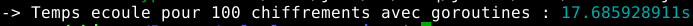

Ce qui revient à 0.17 seconde pour 1 exécution de cet exemple-ci. 

On remarque une certaine différence, mais ce n'est pas conséquent sachant que le chiffrement/déchiffrement d'un unique fichier est très rapide. En effet, la rapidité du chiffrement symétrique est son point fort. 